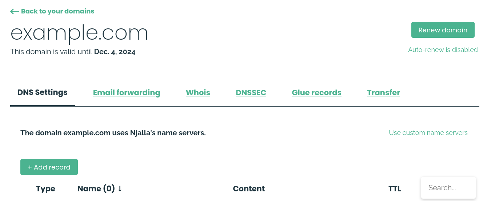
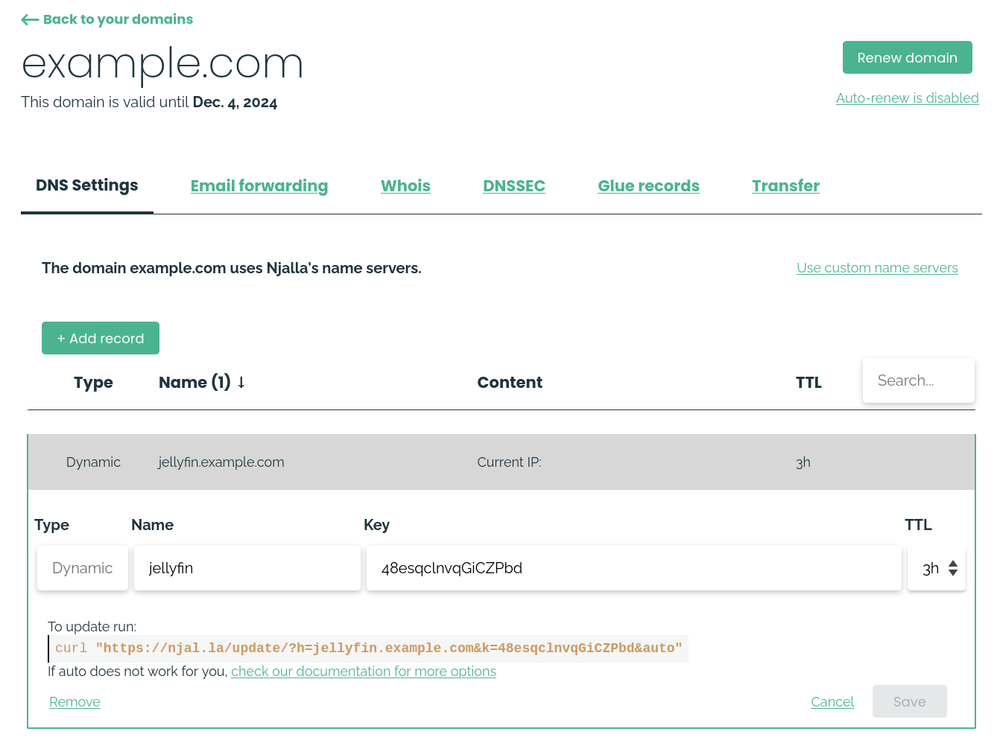

Go to your domain on njalla:



Then press "Add record", select "Dynamic" and write your subdomain in the
input box. It should now be added to your records. Click on the record,
you should now see something like the following:



Given this, your JSON file should contain the following:

```json
  {
    "jellyfin.example.com": "48esqclnvqGiCZPbd"
  }
```

Add the above as a secret file to your secrets (See [this page](/wiki/secrets)
for secrets management). As an example, here is one way of accomplishing it:

- Write the specified JSON to `/data/.secret/njalla/keys-file.json`
- Set the owner as root: 
  - `sudo chown root:root /data/.secret/njalla/keys-file.json`
- Set the permissions to 700 (read, write, execute for file owner, root): 
  - `sudo chmod 700 /data/.secret/njalla/keys-file.json`

And finally add the secret file to your nix configuration:

```nix
  nixarr.ddns.njalla = {
    enable = true;
    keysFile = "/data/.secret/njalla/keys-file.json";
  };
```

After rebuilding, you can check the output of the DDNS script:

```sh
  sudo systemctl status ddnsNjalla.service
```

Where you should see something like:

```
  Mar 03 21:05:00 pi systemd[1]: Starting Sets the Njalla DDNS records...
  Mar 03 21:05:02 pi ddns-njalla[26842]: {"status": 200, "message": "record updated", "value": {"A": "93.184.216.34"}}
  Mar 03 21:05:02 pi ddns-njalla[26845]: {"status": 200, "message": "record updated", "value": {"A": "93.184.216.34"}}
  Mar 03 21:05:02 pi systemd[1]: ddnsNjalla.service: Deactivated successfully.
  Mar 03 21:05:02 pi systemd[1]: Finished Sets the Njalla DDNS records.
  Mar 03 21:05:02 pi systemd[1]: ddnsNjalla.service: Consumed 560ms CPU time, received 11.7K IP traffic, sent 3.0K IP traffic.
```

Then run the following to get your public IP address:

```sh
  curl https://ipv4.icanhazip.com/ 
```

And if you check your njalla domain page, you should see your public IP
on your Dynamic DNS record! After waiting a little you should be able to
connect to your ip, using the set domain.
